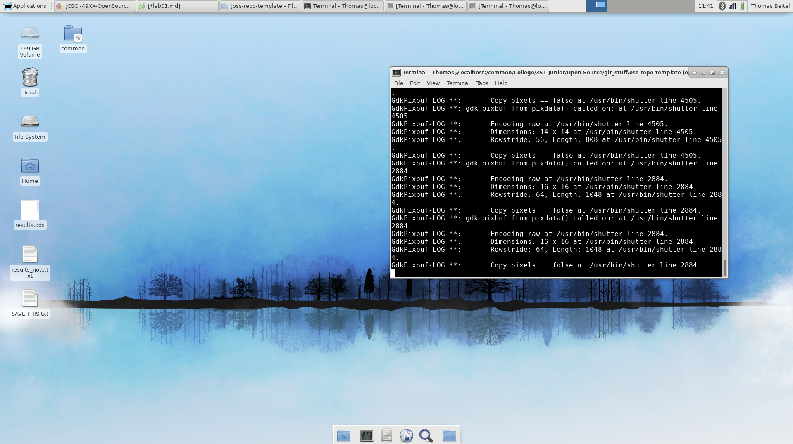
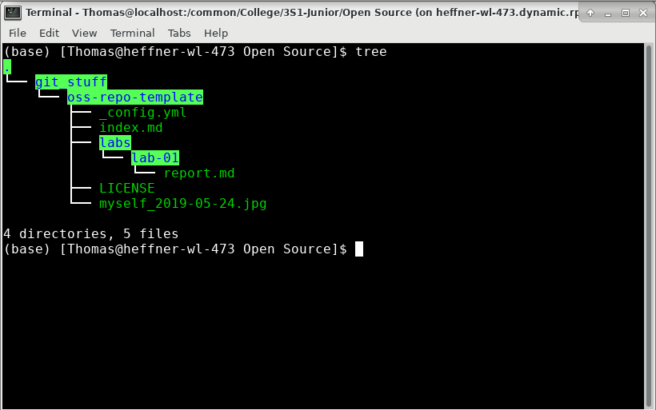
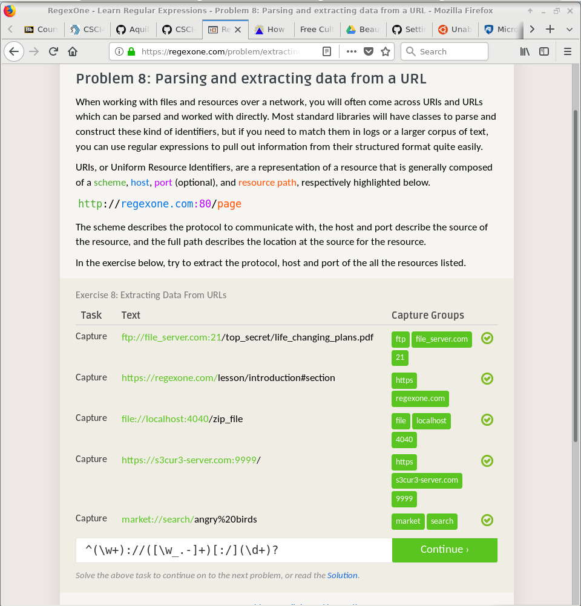
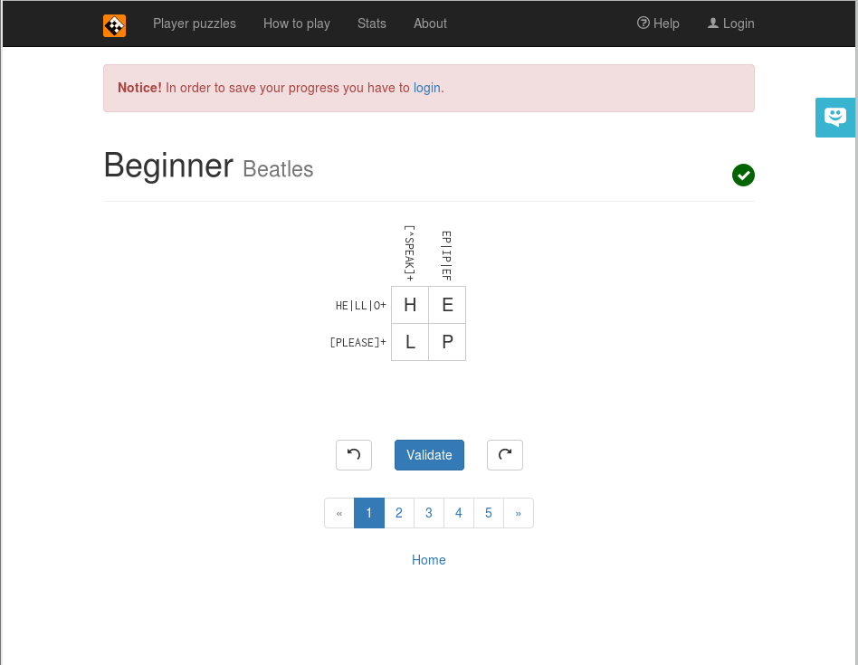
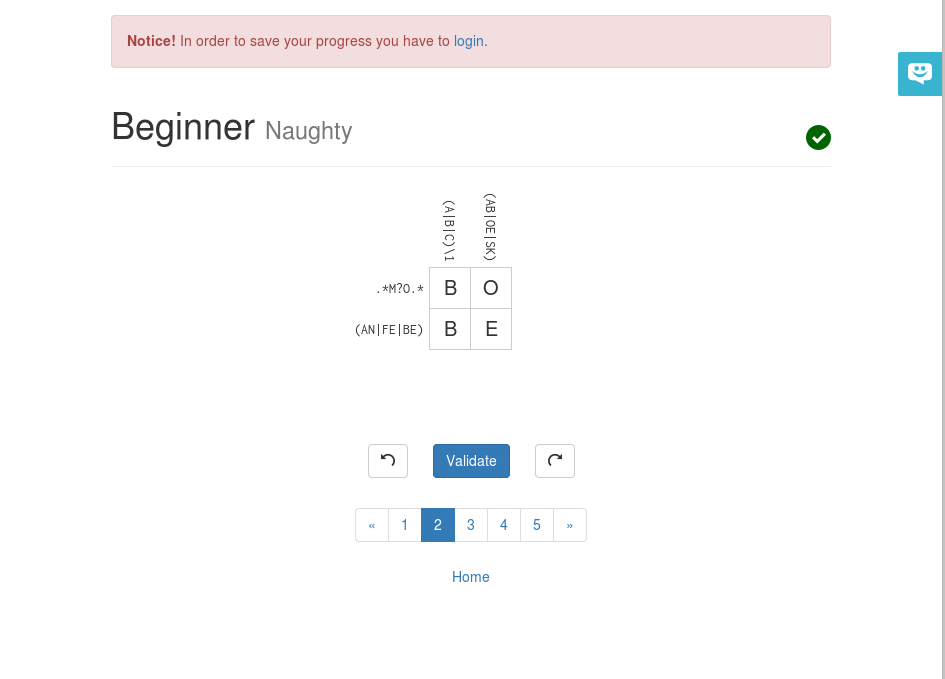
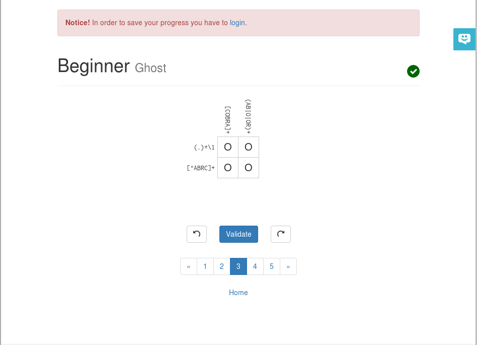
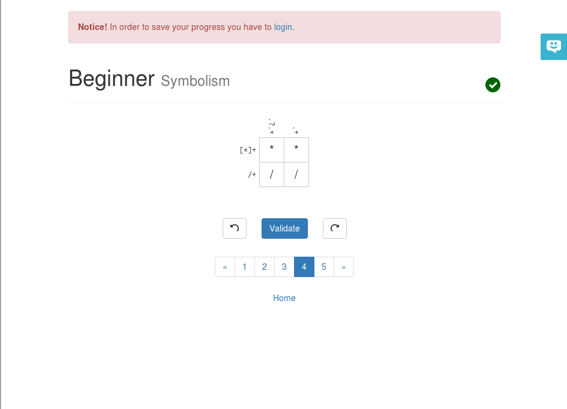

# Lab 01

## Reading Assignments
### Open Source Definition
The gist of the definition is open distribution of a program and its source code for others to use and modify. Many of the definitions are further clarifications on that point.

### Smart Questions

### Free Culture

## Linux
### Boot
I still have my Fedora boot from Data Structures so here is that.

### Tree
Here is my tree from a relevant folder.

## Regex

### Problems

### Crossword

