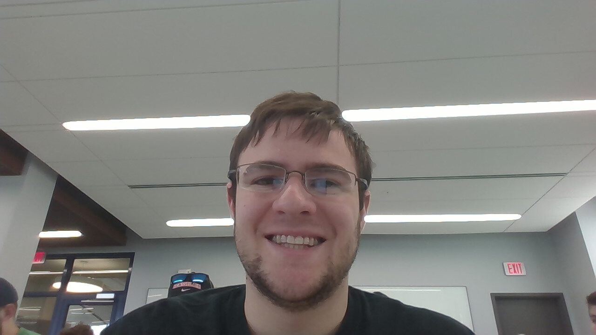

# Open Source Software - Summer 2019
## Thomas Beitel

### E-mail
beitet@rpi.edu

### GitHub Account
Aquilafer

## Bio
I come from Medford, NJ (~30min east of Philadelphia). I taught myself how to program in sophmore year of high school. I like Python, respect C and C++, and despise Java.

## Lab Reports
[Lab 1](labs/lab-01/report.md)
