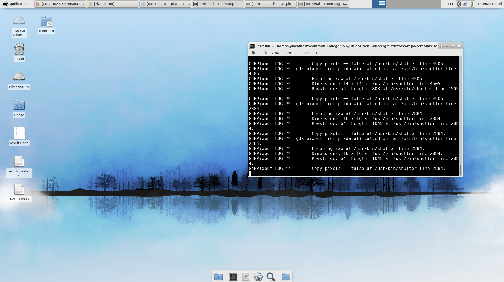
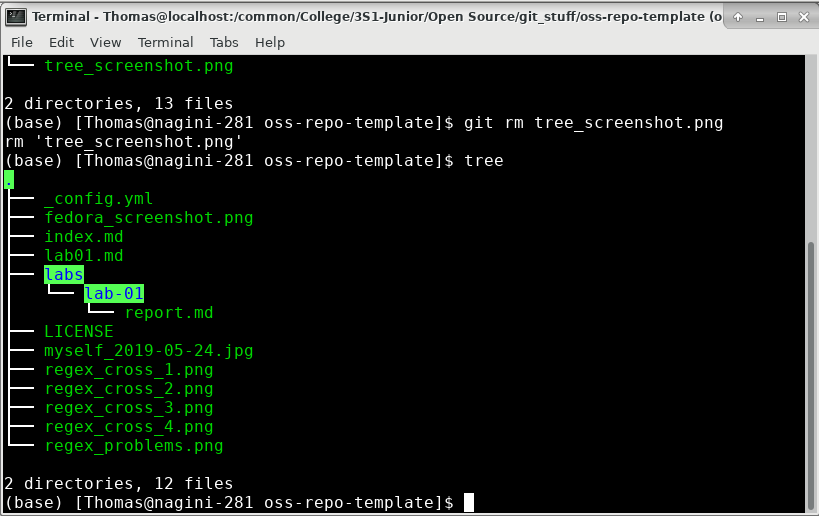
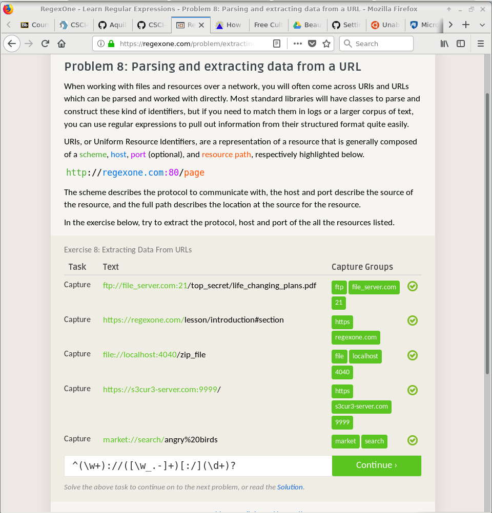
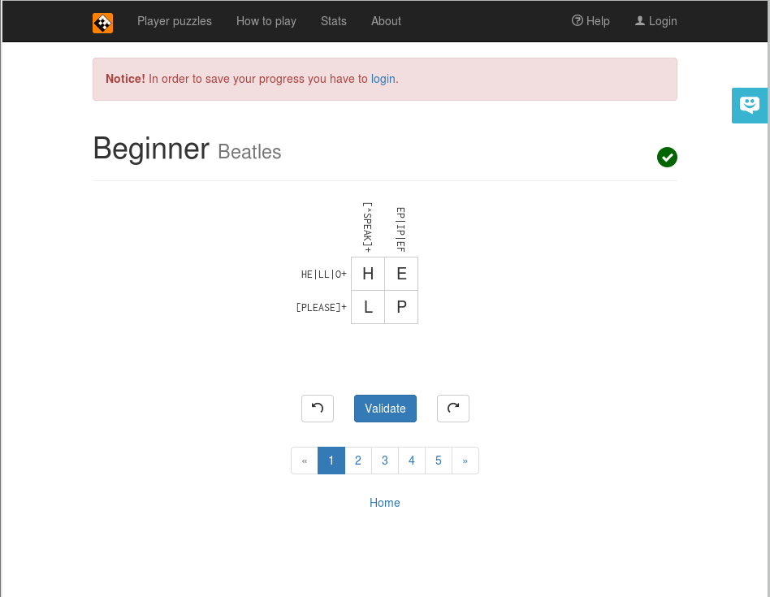
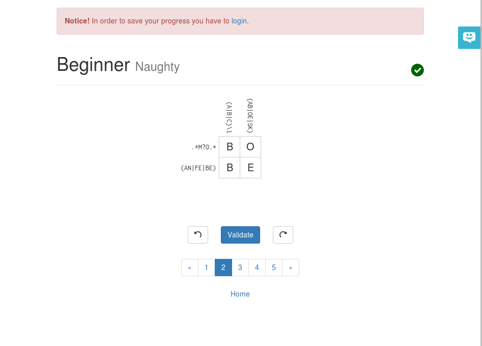
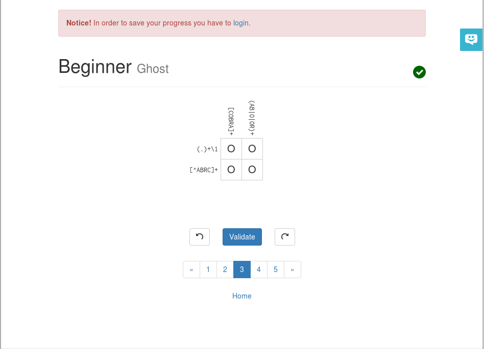
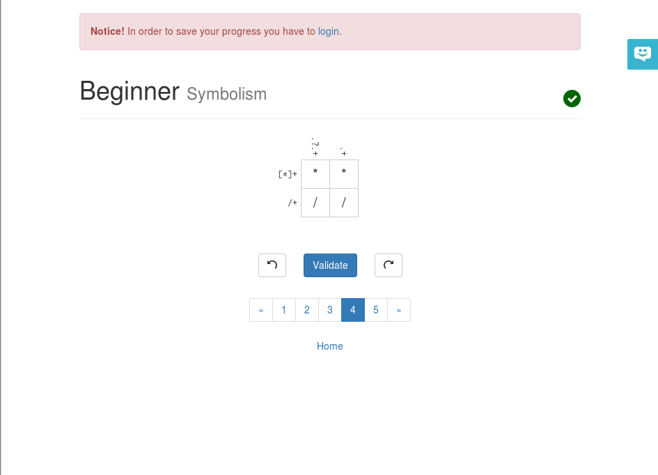
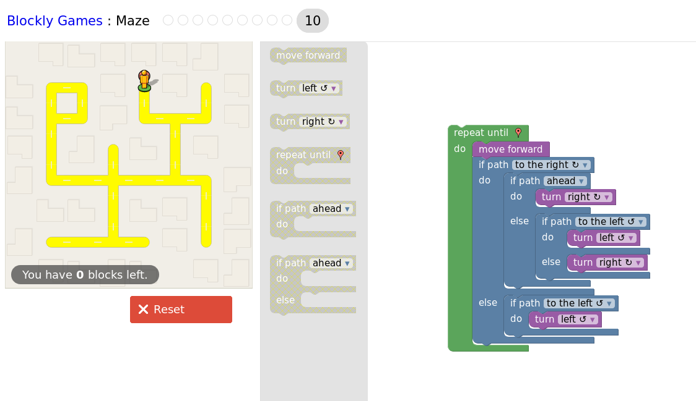

# Lab 01

## Reading Assignments
### Open Source Definition
The gist of the definition is open distribution of a program and its source code for others to use and modify. Many of the definitions are further clarifications on that point.

### Smart Questions
- Be aware of what the user is asking. Too often, I have seen people answer a similar problem to what the questioner is asking (or more likely posting a link to an answer) without actually answering the actual problem. Be aware that sometimes the question isn't about how to solve A or B, but how to do them together which is not always as simple as either A or B.
- Watch out for assumptions you might make due to your own perspective. Just because something is trivial to you doesn't mean it is that way for everybody.
- Make the answers both simple and complete. This depends a lot on the audience, but be aware that most newer users are probably not too familiar with most of the more technical stuff and would appriciate either an answer that does not assume much technical experience or an explanation for the steps separating the technical nature of the solution from its complex appearance.

### Free Culture

## Linux
### Boot
I still have my Fedora boot from Data Structures so here is that.

### Tree
Here is my tree from a relevant folder.

## Regex

### Problems

### Crossword

## Blockly

