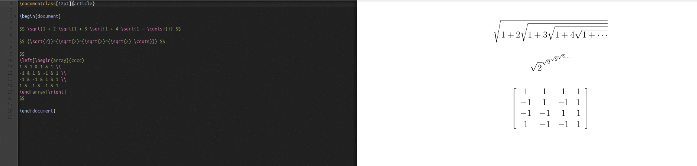

# Lab 03

## Part 1

### Latex

$$ \sqrt{1 + 2 \sqrt{1 + 3 \sqrt{1 + 4 \sqrt{1 + \cdots}}}} $$

$$ {\sqrt{2}}^{\sqrt{2}^{\sqrt{2}^{\sqrt{2} \cdots}}} $$

$$
\left[\begin{array}{cccc}
1 & 1 & 1 & 1 \\
-1 & 1 & -1 & 1 \\
-1 & -1 & 1 & 1 \\
1 & -1 & -1 & 1
\end{array}\right]
$$

Result:

## Part 2:

### AutoGrading

#### Manual

Unable to find number of contributors

When I click on the page, it gets stuck like this:

According to "git ls-files -z | xargs -0 wc -l"  
Lines of Code: 761878

First Commit:  
2017-09-15  
b1b4078cba4e1b682c7e636a207768d1bf628d10

Last Commit:  
2019-01-17  
e811722cc8c9e22941272da568a0f42509d60c76

Current branches: 1

#### Automatic Door Control

Number of contributors: 3

Lines of Code: 1068

First Commit:  
2018-01-26  
0d579f8012bdfa949d89500c11a9454ac87f4c11

Last Commit:  
2019-04-05  
cc3b6e9b5373ea4e828ad21be22a9bed023370de

#### Late

Number of contributors: 13

Lines of Code: 38850

First Commit:  
2018-09-07

Last Commit:  
2019-06-07

Current branches: 11

#### Open Circuits

Number of contributors: 16

Lines of Code: 15335

First Commit:  
2017-03-22

Last Commit:  
2019-06-06

### Gitstats

#### AutoGrading

Contributors:  18  
Lines of Code: 525352  
First Commit:  2017-09-15  
Last Commit:   2019-01-16

#### Automatic Door Control

Contributors:  3  
Lines of Code: 1068  
First Commit:  2018-06-26  
Last Commit:   2019-04-15

#### Late

Contributors:  13  
Lines of Code: 38850  
First Commit:  2018-09-07  
Last Commit:   2019-06-07

#### Open Circuits

Contributors:  16  
Lines of Code: 15335  
First Commit:  2017-03-22  
Last Commit:   2019-06-06

### Gource

