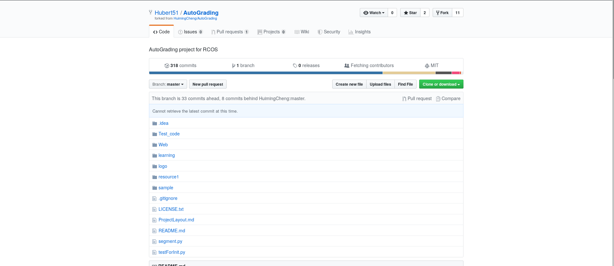
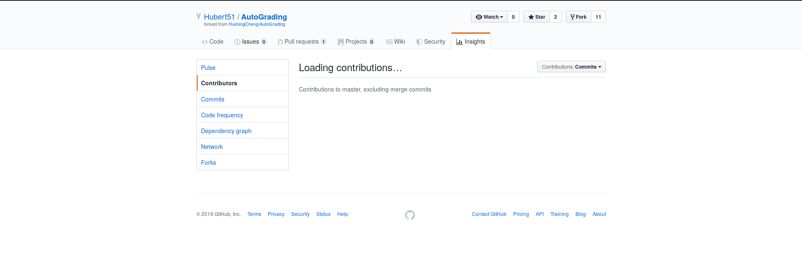
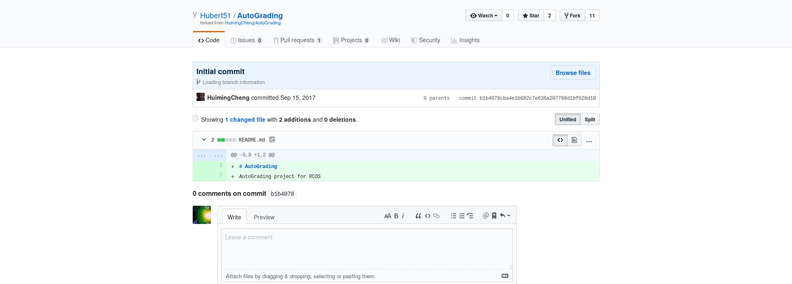
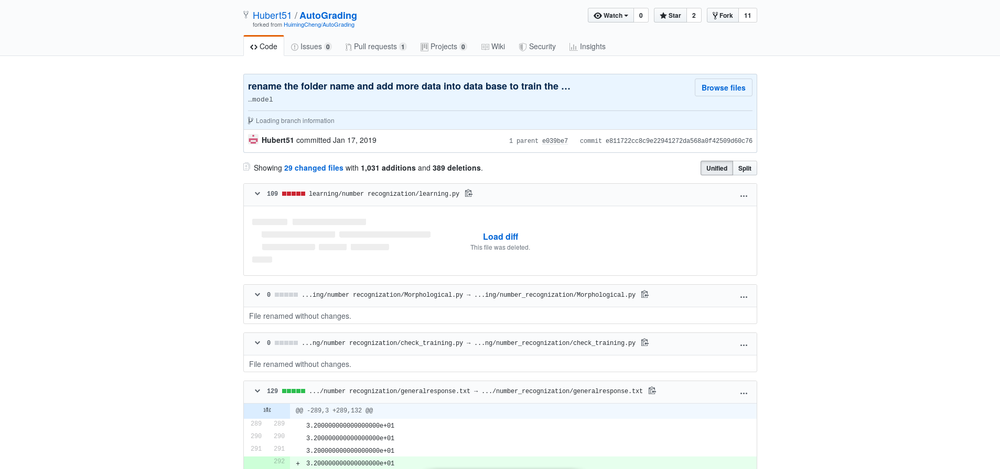
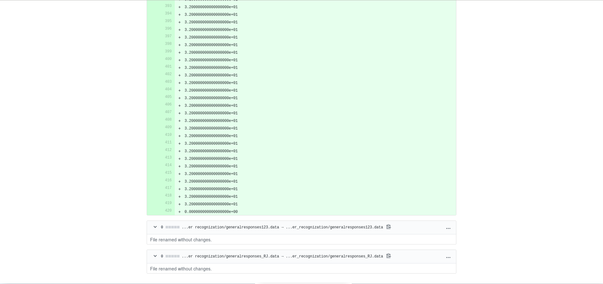

# Lab 03

## Part 1

## Part 2: AutoGrading

### Manual

Unable to find number of contributors

When I click on the page, it gets stuck like this:

According to "git ls-files -z | xargs -0 wc -l"
Lines of Code: 761878

First Commit:
2017-09-15
b1b4078cba4e1b682c7e636a207768d1bf628d10

Last Commit:
2019-01-17
e811722cc8c9e22941272da568a0f42509d60c76

Current branches: 1

### Gitstats

Contributors:  18
Lines of Code: 525352
First Commit:  2017-09-15
Last Commit:   2019-01-16

