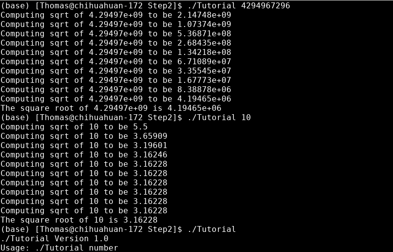
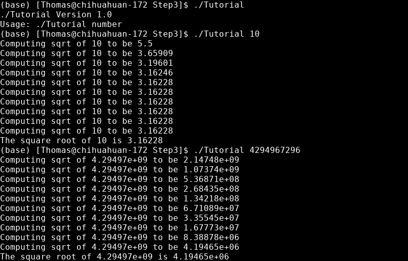
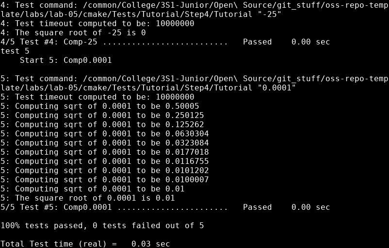
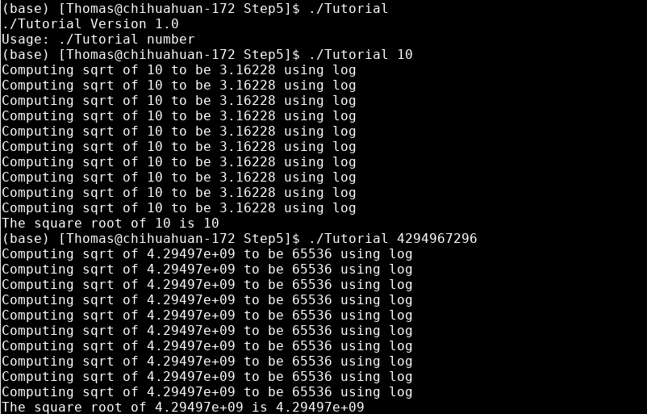
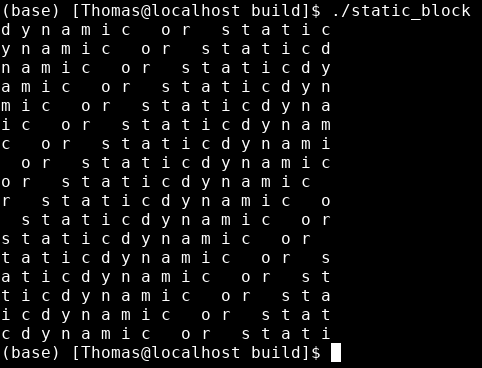

# Lab 5

## CMake Tutorial

### 1.

https://github.com/Aquilafer/oss-repo-template/blob/master/labs/lab-05/Tutorial/Step1/tutorial.cxx

https://github.com/Aquilafer/oss-repo-template/blob/master/labs/lab-05/Tutorial/Step1/CMakeLists.txt

### 2.

https://github.com/Aquilafer/oss-repo-template/blob/master/labs/lab-05/Tutorial/Step2/tutorial.cxx

https://github.com/Aquilafer/oss-repo-template/blob/master/labs/lab-05/Tutorial/Step2/CMakeLists.txt

#### Testing Step 1:

##### In
time for i in {1..1000}; do ./Step1/Tutorial 4294967296; done

##### Out
real	0m1.325s
user	0m0.622s
sys 	0m0.645s

#### Testing Step 2:

##### In
time for i in {1..1000}; do ./Step2/Tutorial 4294967296; done

##### Out
real	0m1.085s
user	0m0.560s
sys 	0m0.524s

### 3.

https://github.com/Aquilafer/oss-repo-template/blob/master/labs/lab-05/Tutorial/Step3/CMakeLists.txt

https://github.com/Aquilafer/oss-repo-template/blob/master/labs/lab-05/Tutorial/Step3/MathFunctions/CMakeLists.txt

### 4.

https://github.com/Aquilafer/oss-repo-template/blob/master/labs/lab-05/Tutorial/Step4/CMakeLists.txt

https://github.com/Aquilafer/oss-repo-template/blob/master/labs/lab-05/Tutorial/Step4/MathFunctions/CMakeLists.txt

### 5.

https://github.com/Aquilafer/oss-repo-template/blob/master/labs/lab-05/Tutorial/Step5/CMakeLists.txt

https://github.com/Aquilafer/oss-repo-template/blob/master/labs/lab-05/Tutorial/Step5/MathFunctions/CMakeLists.txt

## CMake Lab Example

My Makefile:  
https://github.com/Aquilafer/oss-repo-template/blob/master/labs/lab-05/Lab-myMake/build/Makefile

CMake CMakeLists.txt:  
https://github.com/Aquilafer/oss-repo-template/blob/master/labs/lab-05/Lab-CMake/build/CMakeLists.txt

CMake Makefile:  
https://github.com/Aquilafer/oss-repo-template/blob/master/labs/lab-05/Lab-CMake/build/Makefile

Size of program with shared library: 8208 B  
Size of program with static library: 8392 B

Program output:

