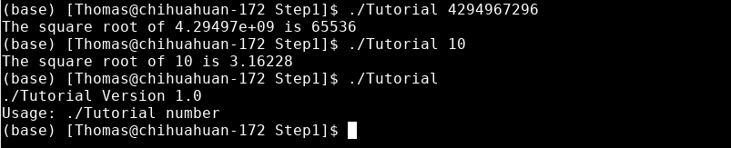

# Lab 5

## CMake Tutorial

### 1.

*path to tutorial.cxx*

*path to CMakeLists.txt*

### 2.

*path to tutorial.cxx*

*path to CMakeLists.txt*

#### Testing Step 1:

##### In
time for i in {1..1000}; do ./Step1/Tutorial 4294967296; done

##### Out
real	0m1.325s
user	0m0.622s
sys 	0m0.645s

#### Testing Step 2:

##### In
time for i in {1..1000}; do ./Step2/Tutorial 4294967296; done

##### Out
real	0m1.085s
user	0m0.560s
sys 	0m0.524s

### 3.

*path to CMakeLists.txt*

*path to MathFuction/CMakeLists.txt*

### 4.

*path to CMakeLists.txt*

*path to MathFuction/CMakeLists.txt*

### 5.

*path to CMakeLists.txt*

*path to MathFuction/CMakeLists.txt*

