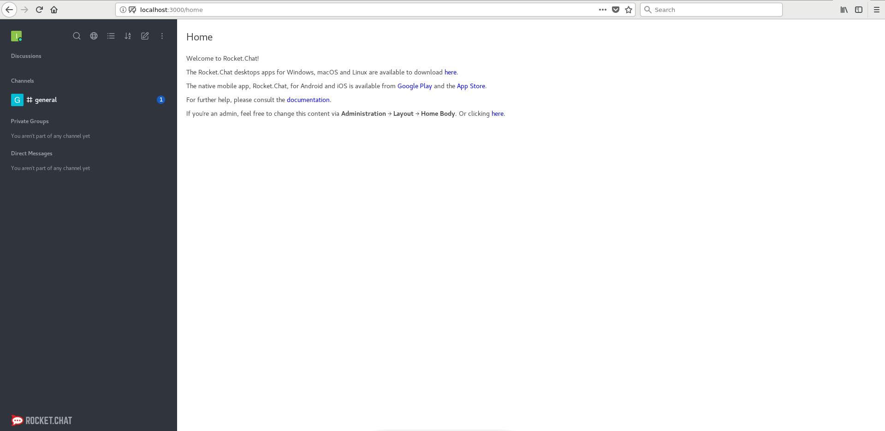
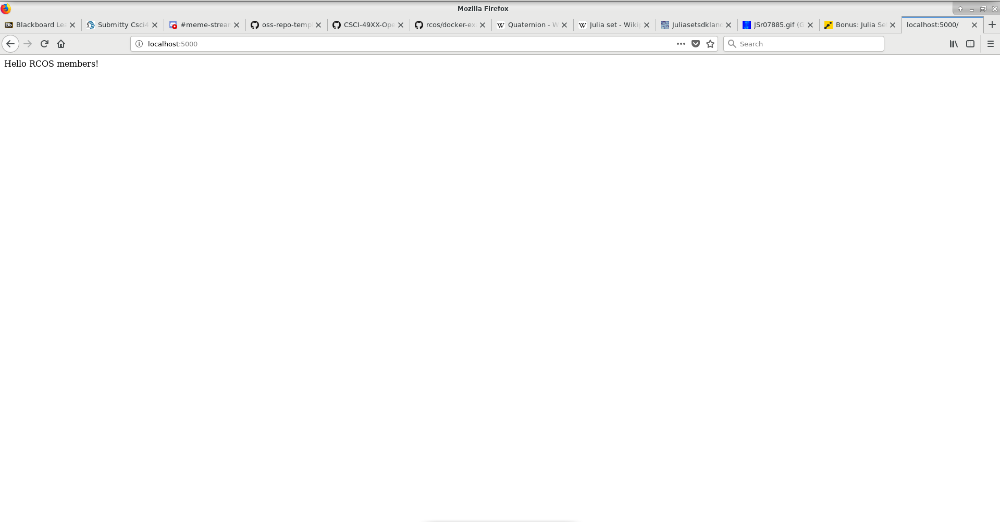

# Lab 6

## Docker

0. 

````
[root@chikadee-407 messageApp]# docker run docker/whalesay cowsay boo
Unable to find image 'docker/whalesay:latest' locally
Trying to pull repository docker.io/docker/whalesay ... 
sha256:178598e51a26abbc958b8a2e48825c90bc22e641de3d31e18aaf55f3258ba93b: Pulling from docker.io/docker/whalesay
e190868d63f8: Pull complete 
909cd34c6fd7: Pull complete 
0b9bfabab7c1: Pull complete 
a3ed95caeb02: Pull complete 
00bf65475aba: Pull complete 
c57b6bcc83e3: Pull complete 
8978f6879e2f: Pull complete 
8eed3712d2cf: Pull complete 
Digest: sha256:178598e51a26abbc958b8a2e48825c90bc22e641de3d31e18aaf55f3258ba93b
Status: Downloaded newer image for docker.io/docker/whalesay:latest
 _____ 
< boo >
 ----- 
    \
     \
      \     
                    ##        .            
              ## ## ##       ==            
           ## ## ## ##      ===            
       /""""""""""""""""___/ ===        
  ~~~ {~~ ~~~~ ~~~ ~~~~ ~~ ~ /  ===- ~~~   
       \______ o          __/            
        \    \        __/             
          \____\______/   
````

1. 

```
root@57294e755213:/# cd root
root@57294e755213:~# touch test.txt
root@57294e755213:~# vim test.txt
root@57294e755213:~# cat test.txt 
I am writting suff here to test vim
```

```
root@57294e755213:~# su
root@57294e755213:~# cowsay "moo!"
 ______
< moo! >
 ------
        \   ^__^
         \  (oo)\_______
            (__)\       )\/\
                ||----w |
                ||     ||
```

2. 



3.

```
[root@chikadee-407 example03]# docker build -t hello .
Sending build context to Docker daemon  7.68 kB
Step 1/8 : FROM python:3.5
Trying to pull repository docker.io/library/python ... 
sha256:eb21bd4452c1a9b284b89fad6422a804f67bdd721f22f4c9910d9db41b35febd: Pulling from docker.io/library/python
a4d8138d0f6b: Pull complete 
dbdc36973392: Pull complete 
f59d6d019dd5: Pull complete 
aaef3e026258: Pull complete 
6e454d3b6c28: Pull complete 
85f36b619f03: Pull complete 
31bdf141ecc4: Pull complete 
b75976322b8d: Pull complete 
cb9e71631917: Pull complete 
Digest: sha256:eb21bd4452c1a9b284b89fad6422a804f67bdd721f22f4c9910d9db41b35febd
Status: Downloaded newer image for docker.io/python:3.5
 ---> 113c25fa7797
Step 2/8 : RUN apt-get update
 ---> Running in cef2c4ce5ce4
Ign:1 http://deb.debian.org/debian stretch InRelease
Get:2 http://deb.debian.org/debian stretch-updates InRelease [91.0 kB]
Get:3 http://security.debian.org/debian-security stretch/updates InRelease [94.3 kB]
Get:4 http://deb.debian.org/debian stretch Release [118 kB]
Get:5 http://deb.debian.org/debian stretch-updates/main amd64 Packages [27.4 kB]
Get:6 http://deb.debian.org/debian stretch Release.gpg [2434 B]
Get:7 http://security.debian.org/debian-security stretch/updates/main amd64 Packages [499 kB]
Get:8 http://deb.debian.org/debian stretch/main amd64 Packages [7082 kB]
Fetched 7914 kB in 1s (4077 kB/s)
Reading package lists...
 ---> 1ce44606f3c9
Removing intermediate container cef2c4ce5ce4
Step 3/8 : RUN pip install Flask
 ---> Running in 54120683f050
Collecting Flask
  Downloading https://files.pythonhosted.org/packages/9b/93/628509b8d5dc749656a9641f4caf13540e2cdec85276964ff8f43bbb1d3b/Flask-1.1.1-py2.py3-none-any.whl (94kB)
Collecting Jinja2>=2.10.1 (from Flask)
  Downloading https://files.pythonhosted.org/packages/1d/e7/fd8b501e7a6dfe492a433deb7b9d833d39ca74916fa8bc63dd1a4947a671/Jinja2-2.10.1-py2.py3-none-any.whl (124kB)
Collecting Werkzeug>=0.15 (from Flask)
  Downloading https://files.pythonhosted.org/packages/9f/57/92a497e38161ce40606c27a86759c6b92dd34fcdb33f64171ec559257c02/Werkzeug-0.15.4-py2.py3-none-any.whl (327kB)
Collecting itsdangerous>=0.24 (from Flask)
  Downloading https://files.pythonhosted.org/packages/76/ae/44b03b253d6fade317f32c24d100b3b35c2239807046a4c953c7b89fa49e/itsdangerous-1.1.0-py2.py3-none-any.whl
Collecting click>=5.1 (from Flask)
  Downloading https://files.pythonhosted.org/packages/fa/37/45185cb5abbc30d7257104c434fe0b07e5a195a6847506c074527aa599ec/Click-7.0-py2.py3-none-any.whl (81kB)
Collecting MarkupSafe>=0.23 (from Jinja2>=2.10.1->Flask)
  Downloading https://files.pythonhosted.org/packages/6e/57/d40124076756c19ff2269678de7ae25a14ebbb3f6314eb5ce9477f191350/MarkupSafe-1.1.1-cp35-cp35m-manylinux1_x86_64.whl
Installing collected packages: MarkupSafe, Jinja2, Werkzeug, itsdangerous, click, Flask
Successfully installed Flask-1.1.1 Jinja2-2.10.1 MarkupSafe-1.1.1 Werkzeug-0.15.4 click-7.0 itsdangerous-1.1.0
 ---> c99b515df5c5
Removing intermediate container 54120683f050
Step 4/8 : ADD . /opt/webapp/
 ---> a0d2239b0a8a
Removing intermediate container 9677066a3eee
Step 5/8 : WORKDIR /opt/webapp
 ---> 41f3e69d0bed
Removing intermediate container 6dfbebeeec6e
Step 6/8 : ENV FLASK_APP hello.py
 ---> Running in f9089d84f581
 ---> debd29ff32d5
Removing intermediate container f9089d84f581
Step 7/8 : EXPOSE 5000
 ---> Running in 99160513e104
 ---> ba9db2d0dcbe
Removing intermediate container 99160513e104
Step 8/8 : CMD flask run --host=0.0.0.0
 ---> Running in 99024091b02a
 ---> bd25d1843450
Removing intermediate container 99024091b02a
Successfully built bd25d1843450
[root@chikadee-407 example03]# docker run -p 5000:5000 hello
 * Serving Flask app "hello.py"
 * Environment: production
   WARNING: This is a development server. Do not use it in a production deployment.
   Use a production WSGI server instead.
 * Debug mode: off
 * Running on http://0.0.0.0:5000/ (Press CTRL+C to quit)
172.17.0.1 - - [12/Jul/2019 18:39:09] "GET / HTTP/1.1" 200 -
```



4. https://github.com/Aquilafer/oss-repo-template/blob/master/labs/lab-06/docker-examples/example04/messageApp/Dockerfile

Ouput before adding .yml file:
```
[root@chikadee-407 messageApp]# docker images
REPOSITORY          TAG                 IMAGE ID            CREATED             SIZE
message-app         latest              43907a7f1341        8 seconds ago       1.05 GB
docker.io/node      10.15.3             5a401340b79f        2 months ago        899 MB
```

````
[root@chikadee-407 messageApp]# docker run message-app
debug: The `sails.config.models.connection` setting is deprecated.  Please use `sails.config.models.datastore` instead.
debug: For more info, see http://sailsjs.com/documentation/upgrading/to-v-1-0/#?changes-to-database-configuration

error: A hook (`orm`) failed to load!
error: Could not tear down the ORM hook.  Error details: Error: Consistency violation: Attempting to tear down a datastore (`mongo`) which is not currently registered with this adapter.  This is usually due to a race condition in userland code (e.g. attempting to tear down the same ORM instance more than once), or it could be due to a bug in this adapter.  (If you get stumped, reach out at http://sailsjs.com/support.)
    at Object.teardown (/app/node_modules/sails-mongo/lib/index.js:390:19)
    at /app/node_modules/waterline/lib/waterline.js:758:27
    at /app/node_modules/waterline/node_modules/async/dist/async.js:3047:20
    at eachOfArrayLike (/app/node_modules/waterline/node_modules/async/dist/async.js:1002:13)
    at eachOf (/app/node_modules/waterline/node_modules/async/dist/async.js:1052:9)
    at Object.eachLimit (/app/node_modules/waterline/node_modules/async/dist/async.js:3111:7)
    at Object.teardown (/app/node_modules/waterline/lib/waterline.js:742:11)
    at Hook.teardown (/app/node_modules/sails-hook-orm/index.js:246:30)
    at Sails.wrapper (/app/node_modules/@sailshq/lodash/lib/index.js:3275:19)
    at Object.onceWrapper (events.js:277:13)
    at Sails.emit (events.js:189:13)
    at Sails.emitter.emit (/app/node_modules/sails/lib/app/private/after.js:56:26)
    at /app/node_modules/sails/lib/app/lower.js:67:11
    at beforeShutdown (/app/node_modules/sails/lib/app/lower.js:45:12)
    at Sails.lower (/app/node_modules/sails/lib/app/lower.js:49:3)
    at Sails.wrapper [as lower] (/app/node_modules/@sailshq/lodash/lib/index.js:3275:19)
error: Failed to lift app: Error: Consistency violation: Unexpected error creating db connection manager:
```
MongoError: failed to connect to server [localhost:27017] on first connect [MongoError: connect ECONNREFUSED 127.0.0.1:27017]
    at flaverr (/app/node_modules/flaverr/index.js:94:15)
    at Function.module.exports.parseError (/app/node_modules/flaverr/index.js:371:12)
    at Function.handlerCbs.error (/app/node_modules/machine/lib/private/help-build-machine.js:665:56)
    at connectCb (/app/node_modules/sails-mongo/lib/private/machines/create-manager.js:130:22)
    at connectCallback (/app/node_modules/mongodb/lib/mongo_client.js:428:5)
    at /app/node_modules/mongodb/lib/mongo_client.js:335:11
    at process._tickCallback (internal/process/next_tick.js:61:11)
```
    at Object.error (/app/node_modules/sails-mongo/lib/index.js:268:21)
    at /app/node_modules/machine/lib/private/help-build-machine.js:1514:39
    at proceedToFinalAfterExecLC (/app/node_modules/parley/lib/private/Deferred.js:1149:14)
    at proceedToInterceptsAndChecks (/app/node_modules/parley/lib/private/Deferred.js:909:12)
    at proceedToAfterExecSpinlocks (/app/node_modules/parley/lib/private/Deferred.js:841:10)
    at /app/node_modules/parley/lib/private/Deferred.js:303:7
    at /app/node_modules/machine/lib/private/help-build-machine.js:952:35
    at Function.handlerCbs.error (/app/node_modules/machine/lib/private/help-build-machine.js:742:26)
    at connectCb (/app/node_modules/sails-mongo/lib/private/machines/create-manager.js:130:22)
    at connectCallback (/app/node_modules/mongodb/lib/mongo_client.js:428:5)
    at /app/node_modules/mongodb/lib/mongo_client.js:335:11
    at process._tickCallback (internal/process/next_tick.js:61:11)
````

https://github.com/Aquilafer/oss-repo-template/blob/master/labs/lab-06/docker-examples/example04/messageApp/docker-compose.yml

````
[root@chikadee-407 messageApp]# docker-compose build
mongo uses an image, skipping
Building app
Step 1/8 : FROM node:10.15.3
Trying to pull repository docker.io/library/node ... 
sha256:c5e919a89352d3ce6a883dde54a5d51dde12229c2d11088593cd1f3efefcc16e: Pulling from docker.io/library/node
c5e155d5a1d1: Pull complete
221d80d00ae9: Pull complete
4250b3117dca: Pull complete
3b7ca19181b2: Pull complete
425d7b2a5bcc: Pull complete
69df12c70287: Pull complete
ad53476a61f2: Pull complete
204bb8bac4a1: Pull complete
Digest: sha256:c5e919a89352d3ce6a883dde54a5d51dde12229c2d11088593cd1f3efefcc16e
Status: Downloaded newer image for docker.io/node:10.15.3
 ---> 5a401340b79f
Step 2/8 : ENV LAST_UPDATED 20190325T175400
 ---> Running in 00aca0c3d842
 ---> a69f86f73aa2
Removing intermediate container 00aca0c3d842
Step 3/8 : COPY . /app
 ---> b4e0e5f78e69
Removing intermediate container efd114d14070
Step 4/8 : WORKDIR /app
 ---> 9d200a124daa
Removing intermediate container 0417bae25366
Step 5/8 : RUN npm install
 ---> Running in 7a96a043a0a6
npm WARN ajv-keywords@3.4.0 requires a peer of ajv@^6.9.1 but none is installed. You must install peer dependencies yourself.

audited 3919 packages in 4.076s
found 111 vulnerabilities (55 low, 2 moderate, 52 high, 2 critical)
  run `npm audit fix` to fix them, or `npm audit` for details
 ---> e54a1a11bc68
Removing intermediate container 7a96a043a0a6
Step 6/8 : RUN npm audit fix
 ---> Running in cd67b1ffc686
npm WARN ajv-keywords@3.4.0 requires a peer of ajv@^6.9.1 but none is installed. You must install peer dependencies yourself.

+ sails@1.2.3
added 11 packages from 13 contributors, removed 63 packages and updated 21 packages in 9.487s
fixed 81 of 111 vulnerabilities in 3919 scanned packages
  2 package updates for 30 vulns involved breaking changes
  (use `npm audit fix --force` to install breaking changes; or refer to `npm audit` for steps to fix these manually)
 ---> 04319bfe375e
Removing intermediate container cd67b1ffc686
Step 7/8 : EXPOSE 1337
 ---> Running in 9807816271ef
 ---> 8719e8106851
Removing intermediate container 9807816271ef
Step 8/8 : CMD node app.js
 ---> Running in d25117c0e78b
 ---> 57f3bc15fec0
Removing intermediate container d25117c0e78b
Successfully built 57f3bc15fec0
[root@chikadee-407 messageApp]# docker-compose up
Creating network "messageapp_default" with the default driver
Creating volume "messageapp_mongo-data" with default driver
Pulling mongo (mongo:4.0.7)...
Trying to pull repository docker.io/library/mongo ... 
sha256:07b8ccd32d40f47892ff5d074626cb9a866f49742658ce872dd1095cb51d9264: Pulling from docker.io/library/mongo
34667c7e4631: Pull complete
d18d76a881a4: Pull complete
119c7358fbfc: Pull complete
2aaf13f3eff0: Pull complete
f7833eaffdda: Pull complete
8287cb5b9daf: Pull complete
ea00040a145a: Pull complete
eeb70119a2ba: Pull complete
066b6bd644f8: Pull complete
17862d4a3122: Pull complete
1cdcc815e975: Pull complete
73e0e2953af7: Pull complete
f719605a4369: Pull complete
Digest: sha256:07b8ccd32d40f47892ff5d074626cb9a866f49742658ce872dd1095cb51d9264
Status: Downloaded newer image for docker.io/mongo:4.0.7
Creating messageapp_mongo_1 ... 
Creating messageapp_mongo_1 ... done
Creating messageapp_app_1 ... 
Creating messageapp_app_1 ... done
Attaching to messageapp_mongo_1, messageapp_app_1
mongo_1  | chown: changing ownership of '/proc/1/fd/1': Permission denied
mongo_1  | chown: changing ownership of '/proc/1/fd/2': Permission denied
mongo_1  | 2019-07-12T19:06:39.644+0000 I CONTROL  [main] Automatically disabling TLS 1.0, to force-enable TLS 1.0 specify --sslDisabledProtocols 'none'
mongo_1  | 2019-07-12T19:06:39.646+0000 I CONTROL  [initandlisten] MongoDB starting : pid=1 port=27017 dbpath=/data/db 64-bit host=150caea63a2c
mongo_1  | 2019-07-12T19:06:39.646+0000 I CONTROL  [initandlisten] db version v4.0.7
mongo_1  | 2019-07-12T19:06:39.646+0000 I CONTROL  [initandlisten] git version: 1b82c812a9c0bbf6dc79d5400de9ea99e6ffa025
mongo_1  | 2019-07-12T19:06:39.646+0000 I CONTROL  [initandlisten] OpenSSL version: OpenSSL 1.0.2g  1 Mar 2016
mongo_1  | 2019-07-12T19:06:39.646+0000 I CONTROL  [initandlisten] allocator: tcmalloc
mongo_1  | 2019-07-12T19:06:39.646+0000 I CONTROL  [initandlisten] modules: none
mongo_1  | 2019-07-12T19:06:39.646+0000 I CONTROL  [initandlisten] build environment:
mongo_1  | 2019-07-12T19:06:39.646+0000 I CONTROL  [initandlisten]     distmod: ubuntu1604
mongo_1  | 2019-07-12T19:06:39.646+0000 I CONTROL  [initandlisten]     distarch: x86_64
mongo_1  | 2019-07-12T19:06:39.646+0000 I CONTROL  [initandlisten]     target_arch: x86_64
mongo_1  | 2019-07-12T19:06:39.646+0000 I CONTROL  [initandlisten] options: { net: { bindIpAll: true } }
mongo_1  | 2019-07-12T19:06:39.648+0000 I STORAGE  [initandlisten] 
mongo_1  | 2019-07-12T19:06:39.648+0000 I STORAGE  [initandlisten] ** WARNING: Using the XFS filesystem is strongly recommended with the WiredTiger storage engine
mongo_1  | 2019-07-12T19:06:39.648+0000 I STORAGE  [initandlisten] **          See http://dochub.mongodb.org/core/prodnotes-filesystem
mongo_1  | 2019-07-12T19:06:39.648+0000 I STORAGE  [initandlisten] wiredtiger_open config: create,cache_size=3349M,session_max=20000,eviction=(threads_min=4,threads_max=4),config_base=false,statistics=(fast),log=(enabled=true,archive=true,path=journal,compressor=snappy),file_manager=(close_idle_time=100000),statistics_log=(wait=0),verbose=(recovery_progress),
mongo_1  | 2019-07-12T19:06:40.314+0000 I STORAGE  [initandlisten] WiredTiger message [1562958400:314895][1:0x7f9de6702a40], txn-recover: Set global recovery timestamp: 0
mongo_1  | 2019-07-12T19:06:40.331+0000 I RECOVERY [initandlisten] WiredTiger recoveryTimestamp. Ts: Timestamp(0, 0)
mongo_1  | 2019-07-12T19:06:40.353+0000 I CONTROL  [initandlisten] 
mongo_1  | 2019-07-12T19:06:40.353+0000 I CONTROL  [initandlisten] ** WARNING: Access control is not enabled for the database.
mongo_1  | 2019-07-12T19:06:40.353+0000 I CONTROL  [initandlisten] **          Read and write access to data and configuration is unrestricted.
mongo_1  | 2019-07-12T19:06:40.353+0000 I CONTROL  [initandlisten] 
mongo_1  | 2019-07-12T19:06:40.356+0000 I STORAGE  [initandlisten] createCollection: admin.system.version with provided UUID: 75764c62-3703-4f1c-85fb-3a5bec61520e
mongo_1  | 2019-07-12T19:06:40.386+0000 I COMMAND  [initandlisten] setting featureCompatibilityVersion to 4.0
mongo_1  | 2019-07-12T19:06:40.389+0000 I STORAGE  [initandlisten] createCollection: local.startup_log with generated UUID: 22c9c2d5-159d-46f4-9b51-33d74e5ad62c
mongo_1  | 2019-07-12T19:06:40.409+0000 I FTDC     [initandlisten] Initializing full-time diagnostic data capture with directory '/data/db/diagnostic.data'
mongo_1  | 2019-07-12T19:06:40.410+0000 I NETWORK  [initandlisten] waiting for connections on port 27017
mongo_1  | 2019-07-12T19:06:40.411+0000 I STORAGE  [LogicalSessionCacheRefresh] createCollection: config.system.sessions with generated UUID: ee84b902-71ac-44fe-a564-6cae07e66847
mongo_1  | 2019-07-12T19:06:40.449+0000 I INDEX    [LogicalSessionCacheRefresh] build index on: config.system.sessions properties: { v: 2, key: { lastUse: 1 }, name: "lsidTTLIndex", ns: "config.system.sessions", expireAfterSeconds: 1800 }
mongo_1  | 2019-07-12T19:06:40.449+0000 I INDEX    [LogicalSessionCacheRefresh] 	 building index using bulk method; build may temporarily use up to 500 megabytes of RAM
mongo_1  | 2019-07-12T19:06:40.450+0000 I INDEX    [LogicalSessionCacheRefresh] build index done.  scanned 0 total records. 0 secs
app_1    | debug: The `sails.config.models.connection` setting is deprecated.  Please use `sails.config.models.datastore` instead.
app_1    | debug: For more info, see http://sailsjs.com/documentation/upgrading/to-v-1-0/#?changes-to-database-configuration
app_1    | 
mongo_1  | 2019-07-12T19:06:41.245+0000 I NETWORK  [listener] connection accepted from 172.18.0.3:41670 #1 (1 connection now open)
mongo_1  | 2019-07-12T19:06:41.250+0000 I NETWORK  [conn1] received client metadata from 172.18.0.3:41670 conn1: { driver: { name: "nodejs", version: "2.2.25" }, os: { type: "Linux", name: "linux", architecture: "x64", version: "4.16.11-100.fc26.x86_64" }, platform: "Node.js v10.15.3, LE, mongodb-core: 2.1.9" }
app_1    |  info: 
app_1    |  info:                .-..-.
app_1    |  info: 
app_1    |  info:    Sails              <|    .-..-.
app_1    |  info:    v1.2.3              |\
app_1    |  info:                       /|.\
app_1    |  info:                      / || \
app_1    |  info:                    ,'  |'  \
app_1    |  info:                 .-'.-==|/_--'
app_1    |  info:                 `--'-------' 
app_1    |  info:    __---___--___---___--___---___--___
app_1    |  info:  ____---___--___---___--___---___--___-__
app_1    |  info: 
app_1    |  info: Server lifted in `/app`
app_1    |  info: To shut down Sails, press <CTRL> + C at any time.
app_1    | debug: -------------------------------------------------------
app_1    |  info: Read more at https://sailsjs.com/support.
app_1    | 
app_1    | 
app_1    | debug: :: Fri Jul 12 2019 19:06:41 GMT+0000 (Coordinated Universal Time)
app_1    | debug: Environment : development
app_1    | debug: Port        : 1337
app_1    | debug: -------------------------------------------------------
````

```
(base) [Thomas@chikadee-407 ~]$ curlhttp://localhost:1337/message
[](base) [Thomas@chikadee-407 ~]$ 
(base) [Thomas@chikadee-407 ~]$ curl -XPOST http://localhost:1337/message?text=hello
{
  "text": "hello",
  "createdAt": 1562959070658,
  "updatedAt": 1562959070658,
  "id": "5d28dcde3150327ffc6b84c6"
}(base) [Thomas@chikadee-407 ~]$ curl -XPOST http://localhost:1337/message?text=hola
{
  "text": "hola",
  "createdAt": 1562959081790,
  "updatedAt": 1562959081790,
  "id": "5d28dce931503277ed6b84c7"
}(base) [Thomas@chikadee-407 ~]$ curl http://localhost:1337/message
[
  {
    "text": "hello",
    "createdAt": 1562959070658,
    "updatedAt": 1562959070658,
    "id": "5d28dcde3150327ffc6b84c6"
  },
  {
    "text": "hola",
    "createdAt": 1562959081790,
    "updatedAt": 1562959081790,
    "id": "5d28dce931503277ed6b84c7"
  }
](base) [Thomas@chikadee-407 ~]$ curl -XPUT http://localhost:1337/message/5d28dce3150327ffc6b84c6?text=hey
{
  "text": "hey",
  "createdAt": 1562959070658,
  "updatedAt": 1562959217753,
  "id": "5d28dcde3150327ffc6b84c6"
}(base) [Thomas@chikadee-407 ~]$ curl -XDELETE http://localhost:1337/message/5d2dce931503277ed6b84c7
{
  "text": "hola",
  "createdAt": 1562959081790,
  "updatedAt": 1562959081790,
  "id": "5d28dce931503277ed6b84c7"
}(base) [Thomas@chikadee-407 ~]$ curl http://localhost:1337/message
[
  {
    "text": "hey",
    "createdAt": 1562959070658,
    "updatedAt": 1562959217753,
    "id": "5d28dcde3150327ffc6b84c6"
  }
](base) [Thomas@chikadee-407 ~]$ 
```
