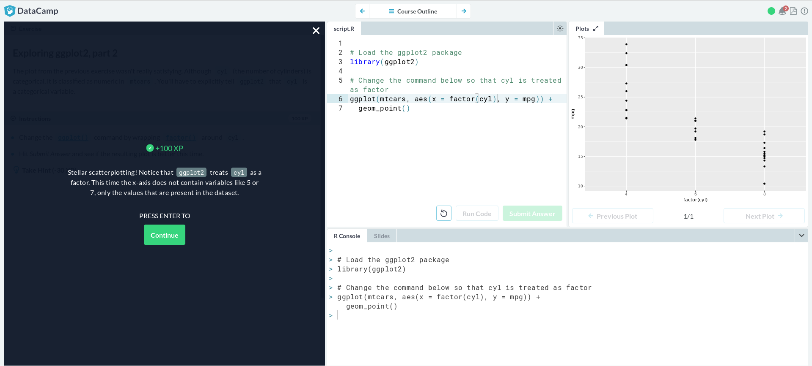

# Lab 08

## 1. Reading

https://github.com/Aquilafer/oss-repo-template/blob/master/labs/lab-08/Zhao_R_and_data_mining.pdf

## 2. Create Datacamp Account

## 3. Data Visualization

## 4. Multiple and Logistic Regression

## 5. Project Webpage

https://rcos.io/projects/team-notex/notex/profile
