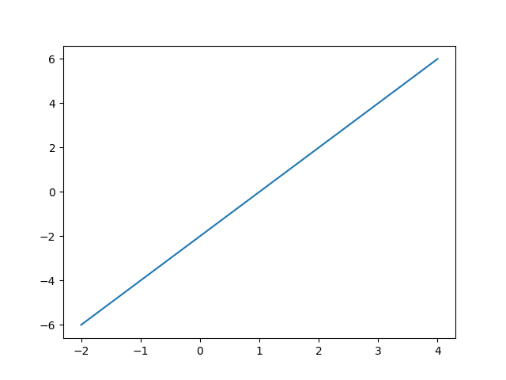
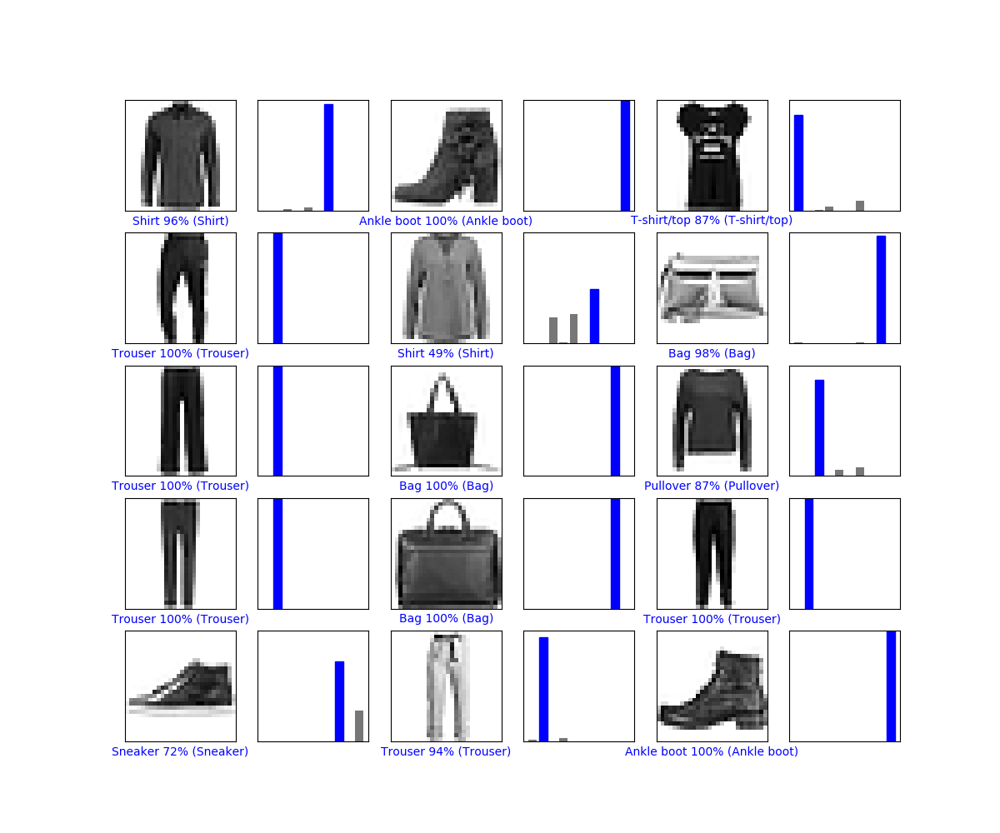
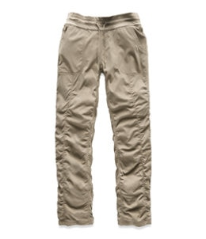
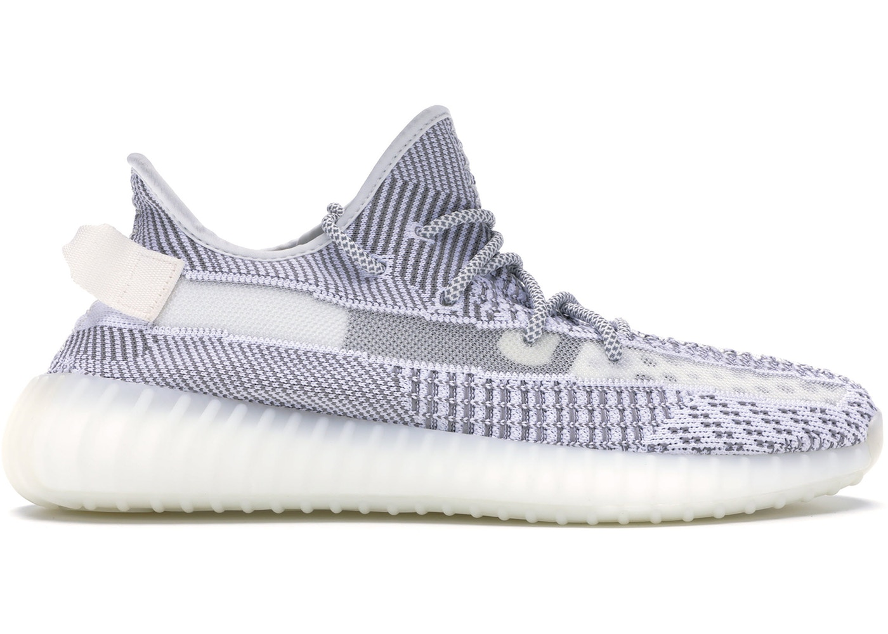
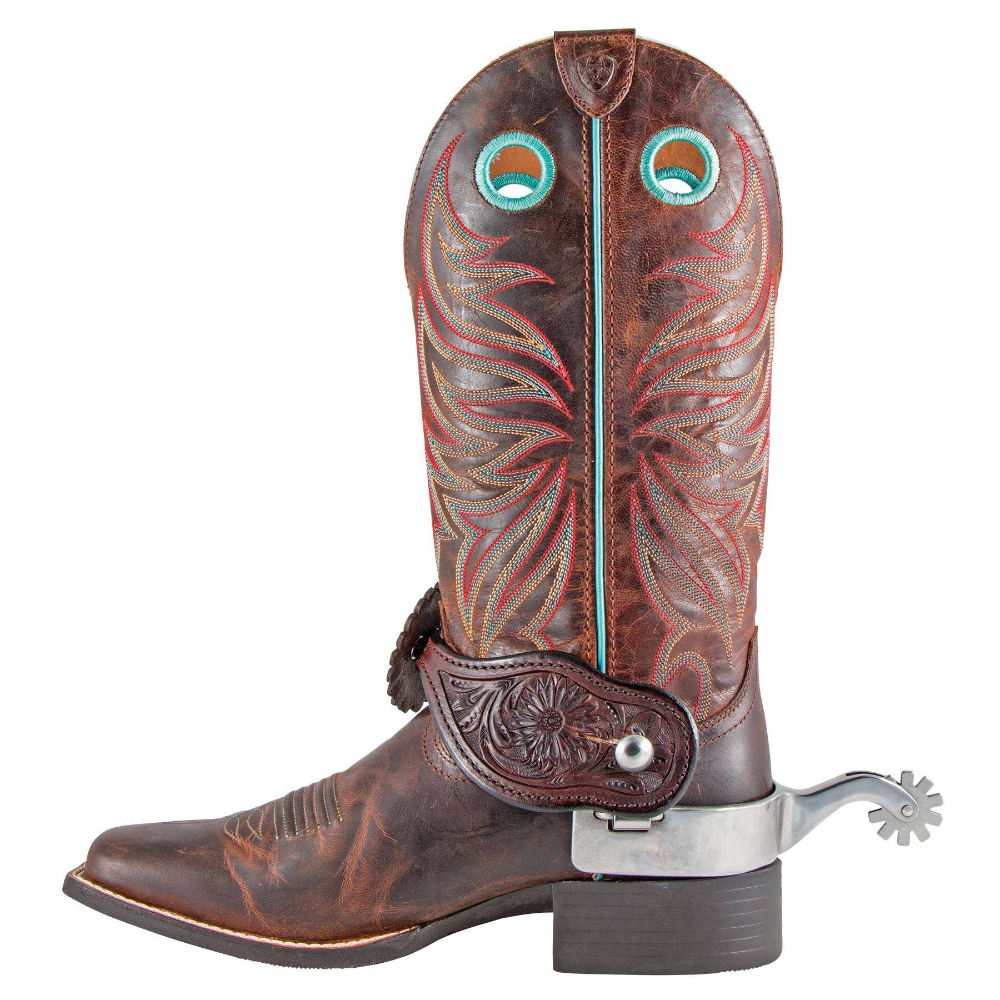
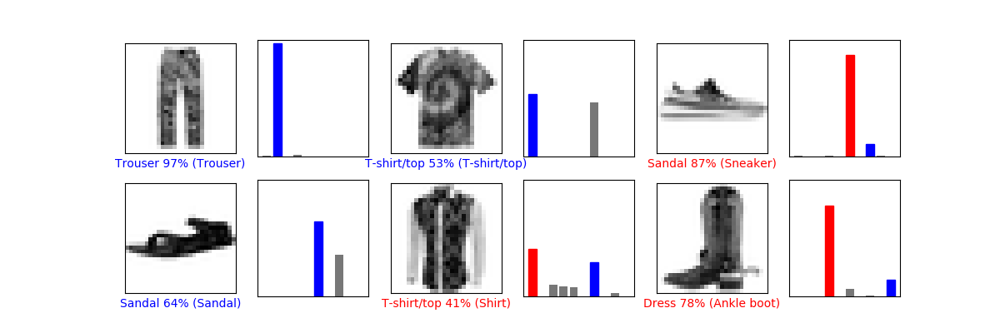

# Lab 09

## Checkpoint 1: Making Sure Everything Works

https://github.com/Aquilafer/oss-repo-template/blob/master/labs/lab-09/TF_ckpt1.py

## Checkpoint 2: My First Machine Learning

https://github.com/Aquilafer/oss-repo-template/blob/master/labs/lab-09/TF_ckpt2.py

## Checkpoint 3: Making My Own Data

### Initial Images

### Results

https://github.com/Aquilafer/oss-repo-template/blob/master/labs/lab-09/TF_ckpt3.py

