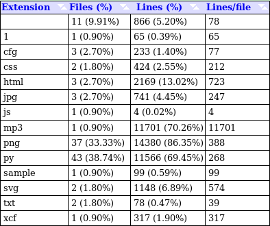

# Analysis of Open Source

### Thomas Beitel

## Part 1

Note: I used the FireFox web browser which did not include the extention used 
to get the size of the repo. Therefore, I used gitstats instead to get the line 
numbers for the "Project Size" box.

### Nyx

https://nyx.torproject.org/  
https://gitweb.torproject.org/nyx.git/

| Category               | Score | Explanation                                                                                                                                                                                                                                                                                                                                                        |
|------------------------|-------|--------------------------------------------------------------------------------------------------------------------------------------------------------------------------------------------------------------------------------------------------------------------------------------------------------------------------------------------------------------------|
| Licensing              | 2     | Nyx uses the GPLv3 open source license (OSI approved).                                                                                                                                                                                                                                                                                                                            |
| Language               | 2     | Nyx is mostly written in Python with which I have much experience.                                                                                                                                                                                                                                                                                                 |
| Level of Activity      | 2     | There have been commits in all of the past four quarters, though activity varies greatly per month. Commits from most to least recent quarters: 1, 18, 12, 2                                                                                                                                                                                                      |
| Number of Contributors | 1     | Nyx has 13 total contributors, though most have very little activity.                                                                                                                                                                                                                                                                                                            |
| Project Size           | 1     | Nyx has 16654 lines of code according to gitstats.                                                                                                                                                                                                                                                                                                                 |
| Issue Tracker          | 1     | Because Nyx is not on github, there was no easy way for me to track the issues. I scored based from what I could find from a bug tracker for the project [1] and the developer's blog [2]. The bug tracker has 9 listed bugs, but none have yet been closed. The third one is about a crash on the FreeBSD OS when the user uses the "m" hotkey to open the menu. |
| New Contributor        | 2     | Nyx has a website [3] and an active dev blog [2] with a FAQ  including steps on how to get involved. The most recent developer joined in 2018.                                                                                                                                                                                                                    |
| Community Norms        | 1     | Though I could find no codes of conduct, all forums and sites I browsed showed overwelmingly friendly language.  |
| User Base              | 2     | Nyx seems to have a decent user base with many unaffiliated blogs talking about its use found after a quick Google.                                                                                                                                                                                                                                               |
| Total Score            | 14    | Nxy is obscure, but still quite active with good support for users and contributors.  |

[1] https://trac.torproject.org/projects/tor/query?status=accepted&status=assigned&status=needs_review&status=new&status=reopened&component=Core+Tor%2FNyx&order=priority  
[2] https://blog.atagar.com/  
[3] https://nyx.torproject.org/

### Clickbait Chrome Extension (CCE)

https://github.com/kool814/ClickbaitChromeExtension

| Category               | Score | Explanation                                                                                                                                                                                                                         |
|------------------------|-------|-------------------------------------------------------------------------------------------------------------------------------------------------------------------------------------------------------------------------------------|
| Licensing              | 2     | CCE uses an MIT open source license (OSI approved).                                                                                                                                                                                                |
| Language               | 2     | CCE is mostly (81%) written in python.                                                                                                                                                                                              |
| Level of Activity      | 2     | CCE has been active in the past two quarters since it was made.                                                                                                                                                                     |
| Number of Contributors | 0     | There are only two contributors.                                                                                                                                                                                                    |
| Project Size           | 2     | Although gitstats claims that CCE has over 42000 lines of code, a quick appraisal of the commits shows that almost all of that is probably a library or something while the actual user line count is almost certainly less than 1000.|
| Issue Tracker          | 1     | There is only one listed issue and it is a question on how to install. It has been promptly answered which suggests that the lack of issues is due to the low user count.                                                           |
| New Contributor        | 0     | There is no website or any kind of text showing how to join the project. It seems like the duo is comfortable doing this alone.                                                                                                    |
| Community Norms        | 0     | Could not find ay signifigant community. |
| User Base              | 1     | Like I mentioned earlier, some people seem to be using it, and there are installation instructions, but the user base is obviously very small and the instructions amount to "download our code and manually run the python file". |
| Total Score            | 10    | Decent project, but didn't have much community backing. |

### Music Ex Machina (MxM)

https://github.com/MusicExMachina/MxM

| Category               | Score | Explanation                                                                                                                                                                        |
|------------------------|-------|------------------------------------------------------------------------------------------------------------------------------------------------------------------------------------|
| Licensing              | 2     | MxM uses an MIT open source license (OSI approved).                                                                                                                                               |
| Language               | 0     | MxM mostly uses a language called LilyPond with which I have no experience and will have to learn from scratch. The second most-commonly used is Java, my mortal enemy.           |
| Level of Activity      | 0     | There have been no contributions to MxM in the past year                                                                                                                           |
| Number of Contributors | 1     | MxM has 5 contributors                                                                                                                                                             |
| Project Size           | 1     | MxM has 38610 lines of code.                                                                                                                                                       |
| Issue Tracker          | 0     | Although the issue tracker for MxM isn't empty, none of it looks like bugs and it is all submitted by one of the developers.                                                      |
| New Contributor        | 1     | MxM lacks a website, though does have a description on the github page. When the project was still active, new users joined up until the project's effective abandonment.         |
| Community Norms        | 0     | Could not find ay signifigant community. |
| User Base              | 0     | I had signifigant trouble finding any substantial user base besides the developers. The only evidence of outside interest were from the watch and star counts on the github page. |
| Total Score            | 5     | This project was probably great when it was more active, but the developers seem to have moved on to other projects. |

## Part 2

https://git.torproject.org/nyx.git

Despite being the only project which I investigated that was not on github,
Nyx by far was the most interesting and the most thourough in terms of support.
Nys is an open source branch to the Tor Project with an OSI approved GNU
General Public License Version 3 [1]
This license is likely inherited from the Tor Project itself and ensures
that any new things that branch from Nyx will inherit the GPLv3 license.
Nyx is a command-line monitor for Tor from which one can get detailed data
about one's relay such as bandwidth usage, connections, and event log [2]
This project caught my eye as I actively use the Tor Browser and have long
been interested in internet privacy. Nyx is specifically built for the plethora
of vollunteers who keep the Tor network moving by hosting relays for the
network. This tool helps relay operators monitor their connections giving
the operator necessary data to ensure proper relay activity. Tools like these
make it easier and therefore more viable for people to set up relay stations
for the Tor network. 

Tor, also known as The Onion Router, uses layers of encryption (like an onion)
combined with a relay network to give the closest thing to true annonymity
on the internet. The relays bounce the users signals between several relay
points which obscures the location of the users, while a layered encryption
network obscures the data traveling between the users and the servers they
access. The signifigance of the Tor project itself is evident in its ability
to protect people whose freedom of speech puts them in danger such as political
activists, whistleblowers, and victims of violence. The Tor Project itself
is heavily dependent on relays which are either bought using donations or
set up by vollunteers. The Nyx tool makes it easier for relay hosts operate
relays making it more feasable for businesses and vollunteers to set up these
relays for the Tor network.

Nyx is mostly written in python with some HTML and javascript [3] which are
for the web elements. Python was probably choosen due to its ease to program
in and its open source license. I personally have a lot of experience in
Python and have been programming in it since Sophmore year of high school.
Nyx uses the "curses" Python library [4] which I don't have experience in, but
feel wouldn't be too hard to learn on my own. Therefore, I scored Nyx a 2
in this category.

Nyx's level of activity varied kind of wildly with most activity comming
in bursts of a few days [5]. I found this mildly unusual, but the bursts
happened often enough to get the full score.

Nyx technically has 13 contributors, though most of the work (>90%) is done
by the developer. A closer inspection suggests that the main developer does
the majority of the work and new contributors jump in for a few days (no more
than a few months) to push some new updates before abandoning the project
[6]. This would explain the disparity in workload though does not say great
things for anyone trying to make a more permenant position for themselves
here. I scored Nyx a one because I wasn't exactly happy with the distribution
of work amoungst the contributors and would prefer if there were more people
contributing more that one or two commits.

Nyx is quite large at 16654 lines of code. What was more surprising to me
was the number of lines added and removed (103412 and 86758 respectively).
This shows the age of the project and the amount of work that has been put
into this project over the past ten years [7]. I scored Nyx a one here because
I would prefer a bit smaller of a project to start out with if I had a choice.

Because Nyx was not made on github, I had to take a more roundabout route
to find the list of issues with the program. I did find a bug tracker though 
a link on the main website FAQ about where to report bugs [8][9]. Also in the
FAQ, there were some mentions of trying to close certian bugs. As far as
I can tell, bugs are invesitgated quite thouroughly though I did find a mention
of a terminal bug. Overall, I was quite satisfied with the support given
to finding and fixing bugs explaining my full score to Nyx for Issue Tracking.

Of all the three projects I investigated, Nyx was the only one with a website
and the only one with instructions on how to contribute to the project [2][8].
The instructions themselves were simple and easy to find on the website and
I could see myself having no trouble submitting some contribution of my own.
Thus, I gave it a full score in this category.

I honestly didn't know what to expect for this category. All three of the
projects I searched had either small or non-existant communities where Nyx
had by far the largest presence (and by that I mean "any at all"). The truth
is that anyone considering using Nyx propably already has a Tor relay set
up and a decent technical knowledge. Without the kinds of people who ask
stupid questions, I considered it unlikely that there would be any of the
usual backlash that one might find from a more commonly used program. Nevertheless,
I searched for the most popular Nyx web communities though even the most
popular still only ever had a few people. I found a blog with a decent discussion
[10] as well as a keyworded tor.stackexchange question. Neither had many
people talking; the Project Analysis Activity suggested to find articles
with at least five people and 15 relpies; only the blog post hit 15 replies
(exactly 15 btw), while the most active stackexchange forum had 5 replies/comments
aside from the original question. I'm not exactly happy with the number of
samples I've found, though all of the ones I did find were extremely polite
with users giving patient answers and thanking each other for any help with
their problem. I eventually tried  broadening my horrizon to the Tor community
in large, but I still didn't find very much. Apparently, the community is
so obscure that the first Google search for "tor community" is to a Star
Wars site [12]. Overall, I wanted to give the Nyx community a perfect score
for this category, but I couldn't because the community was really too small
and didn't have any guidelines for proper conduct. Thus, I scored a one in
this category.

For such a small and specific program, I was pleasently surprised to find
a somewhat active community for Nyx. I mean, this software is only really
used by people who operate Tor relays. And yet, the bug tracker is filled
by active users [9], stackexchange questions eventually get answered (it seems
to take a few months though [13]), and a blog talking about Nyx gets plenty
of different people talking about it [10]. Of the three projects I've seen,
Nyx is by far the most used. This active user base awards Nyx with a full
score in the user base category.

All of the projects I looked at for this paper were quite small. Though Nyx
was still the biggest, it still is quite obscure and used by only a small
minority of people. Nevertheless, the Tor community and by extension the
Nyx community is very enthusiastic about what they do and the small part
they play towards the bigger Tor Project. I think this kind of community
would be beneficial, not just for me, but for any enthusiastic person who
supports the ideas nurtured by the Tor Project. I want to support this project
because it supports the ideals of internet privacy and anit-censorship that
I uphold.

[1] https://gitweb.torproject.org/nyx.git/tree/LICENSE

[2] https://nyx.torproject.org/#home

[3] 

[4] https://2019.www.torproject.org/getinvolved/volunteer.html.en#project-nyx

[5] 

[6] 

[7] 

[8] https://nyx.torproject.org/#faq

[9] https://trac.torproject.org/projects/tor/wiki/doc/nyx/bugs

[10] https://blog.torproject.org/meet-nyx-command-line-tor-relay-monitor

[11] https://tor.stackexchange.com/questions/3815/how-can-i-verify-my-relay-is-working

[12] https://www.google.com/search?client=firefox-b-1-ab&biw=954&bih=894&ei=PK0NXd_fIuSpggfEiIrwCg&q=tor+community&oq=tor+community&gs_l=psy-ab.3..0j0i10l2j0i22i10i30j0i22i30j0i22i10i30j0i22i30l3j0i22i10i30.6787.7907..11463...0.0..0.84.508.7......0....1..gws-wiz.......0i71.HEdH4g0I-Bo

[13] https://tor.stackexchange.com/questions/tagged/nyx?sort=newest&pageSize=15
